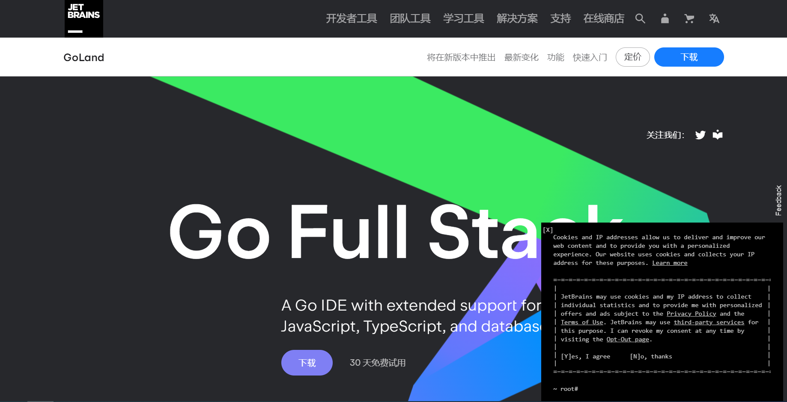
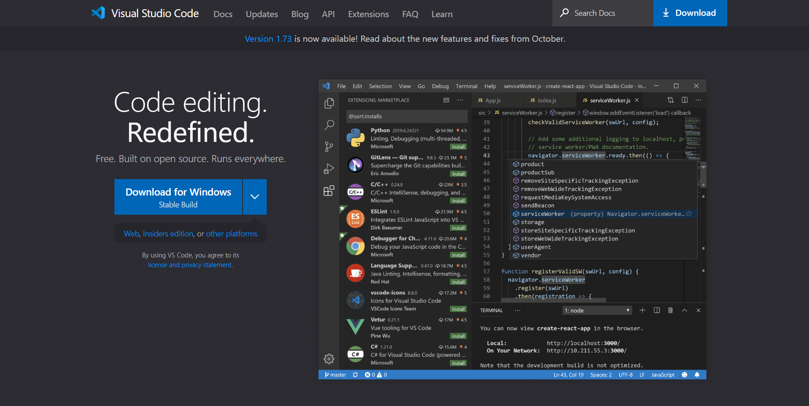
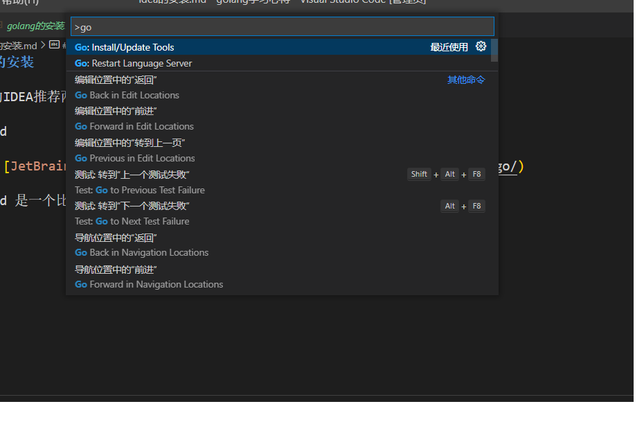
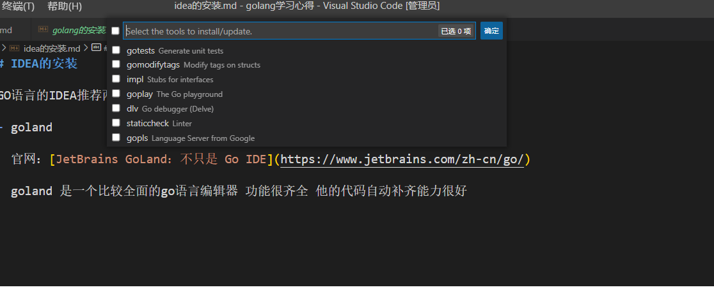

# IDEA的安装

GO语言的IDEA推荐两种：

- **goland**

  官网：[JetBrains GoLand：不只是 Go IDE](https://www.jetbrains.com/zh-cn/go/) 

  goland 是一个比较全面的go语言编辑器 功能很齐全 他的代码自动补齐能力很好，由于是一个比较强的IEDA，所以它是一个收费的产品；附上官网的图片；他有一个30天的试用期。

  

- **vscode**

  vscode 是微软的产品；他的功能可能并没有goland 那么全面但是也是一个不错的选择；他不仅仅可以编写GO语言的代码 通过插件系统 它还可以编写其他语言的代码；通过插件系统的支持对go语言也有一定的支持重点是它是免费的。

  官网：[Visual Studio Code - Code Editing. Redefined](https://code.visualstudio.com/) 

  

  下载完成后还要装插件，打开`vscode 查看(v)---->命令面板`输入以下内容：`go`

  

  选择第一个 `Update Tools` 安装全部

  

  安装完成后它会提示`All tools successfully installed. You are ready to Go. :) `

  然后就安装完成了 可以开始 Go了。