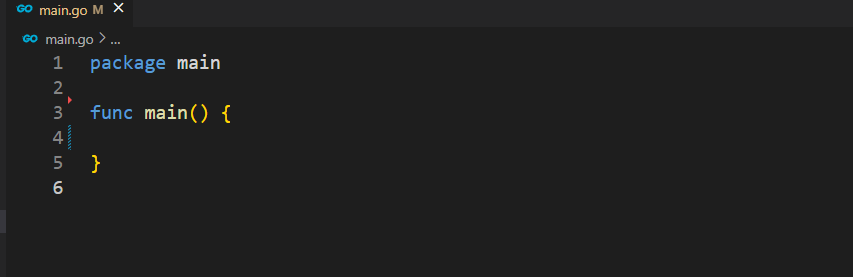

# 变量的定义

1. **package（包的说明**）

   go语言是通过package（包）的概念来管理代码模块的。同一个文件夹下只能有一个package mian（主程序）如果拥有多个编译的时候就会出错。mian函数是程序的入口函数，想要你的程序可执行必须拥有一个 package mian的文件 和mian函数入口，像这样。

   

2. **关键字var 定义变量**

   go语言声明变量可以使用` var`关键字来声明变量。

   ```go
   package main
   
   func main() {
   	var name string      // var 变量名 变量类型
   	var name2 = "yuming" // var 变量名 值 //编译器会根据你给的值推断出它的类型
   
   	fmt.Println(name, name2) // "" , yuming
   }
   ```

3. **重复定义**

   go语言没有重复定义，重复定义会报错。

   ```go
   package main
   
   import "fmt"
   
   func main() {
   	var name string
   	var name string          // name redeclared in this block
   
   }
   
   ```

   

4. **简短变量定义**

   除了上面能用  `var`定义变量还可以用`:=`的方式声明变量。使用`:=`声明的方式只能在函数内声明，而`var`则不受影响，可以在函数体里声明，也可以在全局变量声明，这个全局变量并不是真的全局变量只是在包里，这个在后面会说。

   ```go
   package main
   
   import "fmt"
   
   name3 := "lisi" // error "expected declaration, found name3"
   var name3 string = "list" // ok
   func main() {
   	name := "李四"
   	name2 := "王五"
   	var name4 = "wangwu"     // ok
   	fmt.Println(name, name2) // 李四 王五
   }
   
   
   ```

5. **变量定义一定要使用的问题**

   变量定义之后一定要使用，这其实很好，这样在构建复杂系统的时候才能保证你声明了变量却没有使用的情况。只是小练习的时候有点束缚手脚。

   ```go
   package main
   
   func main() {
   	age := 18       // age declared but not used
   	str := "string" // str declared but not used
       // fmt.println(age,str) 
   }
   
   ```

6. **zeroValue(零值)**

   变量经过声明后，就会给它赋一个初始值 这样的值我们通常叫他为零值(zero value)。学过C语言的同学可能会懂，C语言声明了没赋值，就会指向一个乱七八糟的值，go语言不会，声明了没赋值就是零值。

   ```go
   package main
   
   import "fmt"
   
   func main() {
   	var age int    // age = 0
   	var str string // str = ""
   	var b bool     // b = false
   	// fmt.Println(age, str, b)
   }
   ```

7. **静态类型的语言**

   go'语言是一门强类型的语言，所以它对值的类型有严格的把控，和动态语言（js，php，python）不一样，这点大家要注意。具体有哪些类型的值。以后会说。